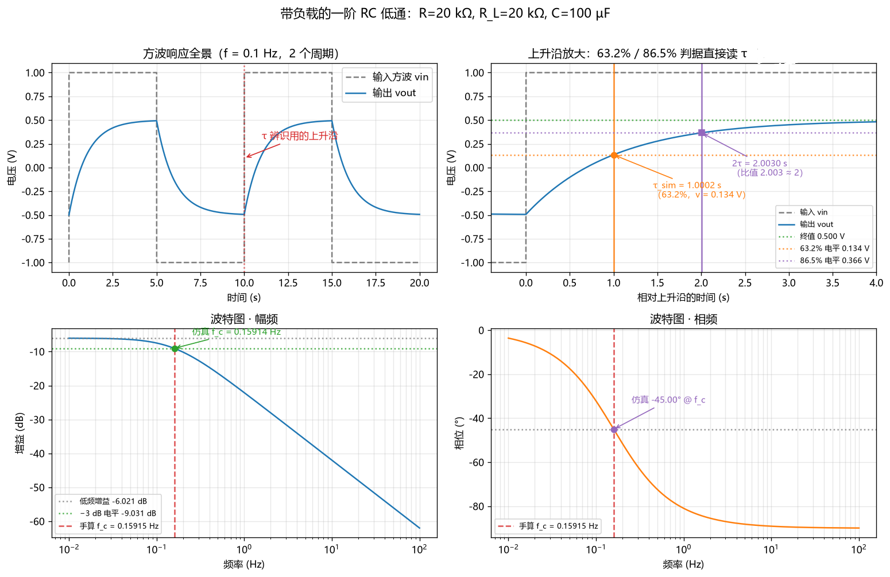
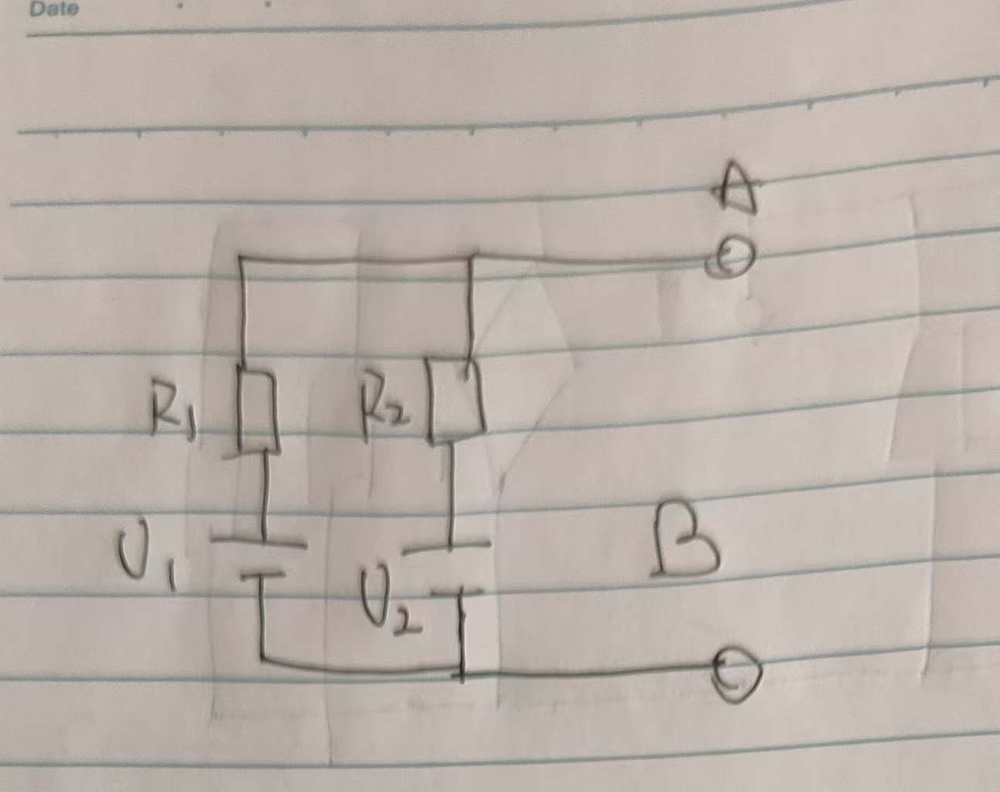
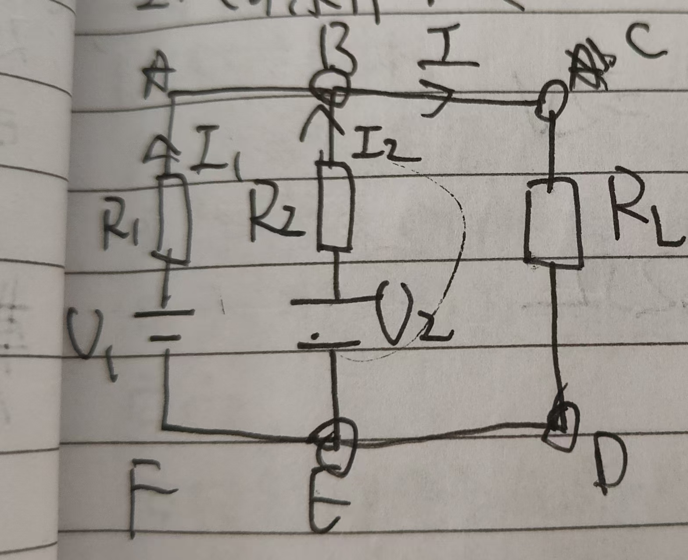
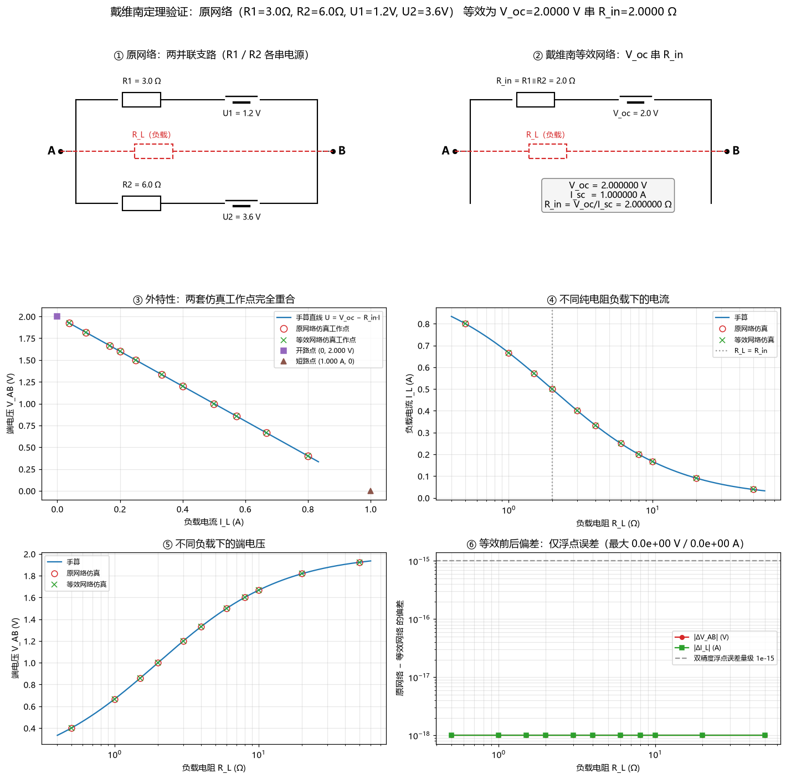
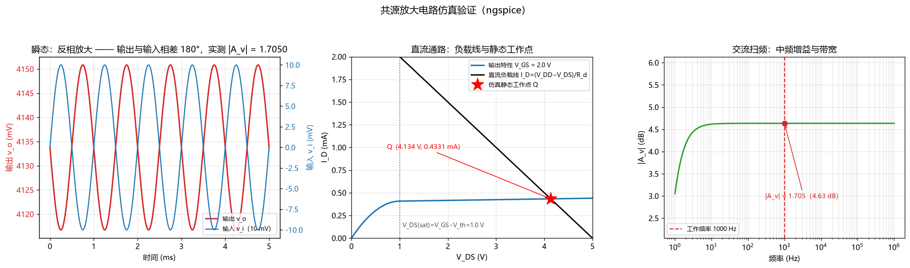

# 项目做了什么

1.完成了基本任务  
2.任务4选择了2048的制作
3.任务5选择了三个电路

# 日志

v0.0.1  sep8  
大致完成了2048的制作，确认了机器学习作为主要方法  
v0.0.2  sep17  
完成了前两个电路的计算与仿真  
v0.0.3 oct3  
完成了nmos放大电路的计算与仿真  
v0.1 oct4\~5  
完成了第五个任务  
v0.2 oct 4\~5
上传了一些文件  
v0.3 oct 4\~5  
制作了并部署了网站，制作了个人简介.pdf  
撰写了一些文本  
v0.4 oct 5  
写了一些文本，上传了一些文件


# 功能如何运行

2048基于HTML制作，没有依赖  
电路仿真基于pyspice1.5,仿真内核为ngspice 47  
除此以外还用到了numpy 2.5.3 / scipy 1.18.1 用于计算  
matplotlib 3.11.2用于画图  
cffi 2.1.1 调用

# 踩过的坑

孩子们我再也不相信经验和大模型了  
1.让大模型去玩2048，指望可以靠这个一次过  
2.用启发式搜索去解2048，指望可以靠经验拿下这个游戏

# AI生成声明

本人声明一切代码**均由**AI生成，无自己调整的痕迹，要调也是自然语言让agent去调

# 分支与合并
分支就是创建当前版本分出的一个独立仓库副本，这个副本不参加主版本迭代，有自己的迭代系统  
合并就是把这个副本和主版本的仓库对比，把副本有的主版本没有的加入主版本  
注意这个操作不会删除分支

# 说明命令
cd 改变路径  
mkdir 创建新路径  
ls 列出该路径下的文件  
git init 初始化为git仓库  
git add <filename> 把xx加入仓库  
git commit -m "这是一些注释" 提交更改  
git push origin master(或其他分支) 把这个仓库推送到远程的服务器的仓库上  
git checkout "xx" 移动到xx分支下     
git branch "xx" 创建xx分支  
git merge "xx" 在除了xx分支时可以使用，把xx合并到该分支下  
git branch -d "xx" 删除xx分支  
git log --oneline 查看提交的哈希值    
git revert commit_id 删除哈希值为x的递交   
git revert HEAD~x 删除前X次的递交   

# 选择MIT协议的原因
1.最简单、最宽松，对所有权的争议小。  
2.是绝大多数项目的选择。

# AI提供错误信息查证
AI表示每次里程碑只计入了一次  
通过观察1024等合成的次数，发现机器更加倾向于合成小的而非合成大的  
猜想可能合成小数字给了多次的奖励，即里程碑的数值有错误/被多次记录
让ai从代码层面去排查这个原因，发现在实际决策里，机器多次记录了里程碑的合成得分，与提供的口径不符  

# 防粘帖承诺

## 1. 2048机器原理解析  

### 基本原理 
不再使用过去的2048经验，改为让机器自己通过盲走调查，即**自博弈**
学习方法使用 TD(0)（δ = 即时好处 + V(下一步) − V(这一步)，逐步就地更新），
训练开关固定为 --lambda 0 --sym 0，α = 0.03 → 0.02 → 0.01，共 23 万局
--lambda 0 表示使用TD方法
--sym 0 每组每步只更新自己表里的 1 条记录（真实朝向）  
否则同一局面按 8 个朝向（4种旋转+镜像*2）让每组在自己表里各更新 8 个不同的编号
α是学习率

##### 棋盘识别
机器识别棋盘的方法，并非把整个棋盘作为一个整体，而是把棋盘裂成多块，每一块分别打分。
原因：  
1.16 格、每格只按“几级”算（哪怕只数到 1024）就有约 11^16 ≈ 4.6×10^16 种排布
2.2048的重点在于局部，而非全局  
如：512是否相邻，2是不是堵住了两个512  
远端的滑块对解这些问题的影响微乎其微  
3.单格太小了

下一个问题就是把棋盘裂成几块，以及把棋盘分裂后，每一个块有多大

我们选择：**基础 4 组 + 各自 90° 旋转 4 组 + 各自 180° 旋转 4 组 = 12 组，每组 6 格**。


```text
基础 4 组（4 个 6 元组）
 A = [0,1,2,3,4,5]          B = [4,5,6,7,8,9]
 ● ● ● ●                    · · · ·
 ● ● · ·                    ● ● ● ●
 · · · ·                    ● ● · ·
 · · · ·                    · · · ·

 C = [0,1,2,4,5,6]          D = [4,5,6,8,9,10]
 ● ● ● ·                    · · · ·
 ● ● ● ·                    ● ● ● ·
 · · · ·                    ● ● ● ·
 · · · ·                    · · · ·

各自顺时针旋转 90° 后，再得 4 组
 A' = [0,4,8,9,12,13]       B' = [1,5,9,10,13,14]
 ● · · ·                    · ● · ·
 ● · · ·                    · ● · ·
 ● ● · ·                    · ● ● ·
 ● ● · ·                    · ● ● ·

 C' = [4,5,8,9,12,13]       D' = [5,6,9,10,13,14]
 · · · ·                    · · · ·
 ● ● · ·                    · ● ● ·
 ● ● · ·                    · ● ● ·
 ● ● · ·                    · ● ● ·

各自再旋转 180°（上下左右颠倒），再得 4 组
 A'' = [10,11,12,13,14,15]  B'' = [6,7,8,9,10,11]
 · · · ·                    · · · ·
 · · · ·                    · · ● ●
 · · ● ●                    ● ● ● ●
 ● ● ● ●                    · · · ·

 C'' = [9,10,11,13,14,15]   D'' = [5,6,7,9,10,11]
 · · · ·                    · · · ·
 · · · ·                    · ● ● ●
 · ● ● ●                    · ● ● ●
 · ● ● ●                    · · · ·
```

这些块叫做组  
这 12 组，每组一张独立的表。

#####  打分机制  
打分机制是一个函数V(棋盘)（V 定义在“滑完、新随机块还没落下”的棋盘上）
他代表：从状态s出发，我能获得的收益是多少？    
函数值越大，越有可能合成1024；越小，越有可能失败  
它满足一个递推关系：
$$V(这一步的局面) \approx 这一步的即时好处 + V(下一步的局面)$$
但是这里只是约等于，为了修复这个误差，我们要计算误差
$$ \delta = 这一步的即时好处 + V(下一步的局面)-V(这一步的局面) $$  
注意$\delta$有正负号  
之后,把所有这个局面命中的组全部按照自己的学习率修改分数
也就是
$$与该局面相关的每个组 += 学习率 α × δ$$
学习率$\alpha$很小，主要是为了让经验占判断的大头，而不是由一两次的运气决定“这个局面是好还是坏”

###### 即时好处
即时好处，即可以马上看到的好处，共分为两部分：得分与里程碑  
得分，即合成滑块的得分；里程碑，即合成出从来没有的大数字。  
我们的目标是合成1024，
所以说，得分的权重偏小，仅为0.05。
里程碑的设计则需要自行设计，
我们的目标是合成1024，则需要在这一步给出较大的奖励。  
| 第一次合成数值 | 奖励 |
| ----- | ----- |
| 128 | 1 |
| 256 | 2 |
|512| 4|
|1024|**24**|
|2048|48|
|4096|96|
|8192|192|
|16384|384|

>为什么1024之后的奖励是继续翻倍？
   为了冲2048

>为什么128之前不设置奖励？
因为可能性大，合成过于简单，不需要奖励

总结:
$$ 这一步的即时好处=0.05*这一步获得的分数+这一步首次达成的里程碑奖励 $$

###### 表格的组成要素

表格由位置编号 / 分数组成
  
编号： 某时刻这 6 格上数字**级别**(级别=$log_2$(滑块数字)（空 = 0）)的快照串  
快照串是可以计算出来的  
分数： 这张表里、这个编号对应的那一个数  
分数是机器自博弈时自己填的

###### 棋盘得分
一个棋盘的十二个组的得分之和就是这个棋盘的得分

## 2.实际操作时的决策
按照如下方式循环
1.把目前状况的棋盘复制四份  
2.每个棋盘往不同的方向走，但不落下新的滑块  
3.计算每个新棋盘的得分(即时好处+表里新棋盘的评分)  
4.找最高得分的棋盘，并**真的**往那个方向走    
若同分，则按“下，右，上，左”的优先级选择方向  
5.系统随机落下新的滑块，机器从第一步开始执行


# 2048提示词

1.帮我制作一个2048游戏，要求如下：

4*4方格，初始生成2个值为2的滑块，每一次滑动后有0.1的可能生成4的滑块，0.9的可能生成2的滑块  

不设置分数上限，游戏可以一直进行下去  

在游戏结束时，再次按下按钮会使得整个棋盘向对应方向振动  

>想让ai做什么：本次迭代中，我想让ai先做出可供游玩的单人游戏。包含了一些基本要求和一些能想到的手感优化  

>完成成果：做出了可以游玩的2048游戏，不过诸如战绩记录，存档等功能还没有实装。

>调整提示词：今后全部以主题诉求+分点要求的方式提供提示词，列举要完成的要求，使ai不做多，不做偏，不做错。

2.为这个2048游戏添加如下功能：  
存档功能：战局结束之后自动存档，存档可以导出和导入，存档记录了从游戏开始时的每一步的行动，并且可以观看每一步的行动  
存档续玩：可以从任何一个存档的任何一步开始续玩这一盘  

>想让ai做什么：实装战绩记录，存档功能  

>完成成果：做出了对应的功能，2048主体基本完结

>调整提示词:往ai自动游玩的方向推进

3.为这个2048游戏添加自动游玩功能，方案指引如下：  
搜集线上的2048攻略，将这些攻略的操作倾向写入自动方向游玩权重  
确保“守角，双向，递减”三个基本原则的实现  
指标：实现能够合成1024，并且800局合成率在80%以上  

>想让ai做什么：实装ai游玩功能，实现1024的自动合成  

>完成成果：1024率在多次权重调整后，发现只能达到75%

>调整提示词：考虑是否是经验导向的启发式搜索的方法本身有限制，转而查询其他的方法

4.搜集线上的资料，提供除了上述启发式学习的方案以外，是否还有其他的方法能实现2048的自动游玩

>想让ai做什么：搜集除了启发式以外的其他可能性

>完成成果：提供了机器学习方案，具体是基于n元组和TD($\lambda$)的学习方案

>调整提示词：决定使用该方法

5.使用该方法，进行机器学习；指标：合成率在80%以上  

>想让ai做什么：实装落地这个方案

>完成成果：效果不错，1024率为91.9%，精修之后1024为94%，但是权重需要导入，违反了单文件规则

>提示词更改：进行文件的集成，任务收尾


6.集成权重与游戏本体为一个文件，删去所有为了调试而存在的功能：如后台自学习，800局测成功率等

>想让ai做什么：把2048项目的所有成果集成为一个可以游玩的2048文件，并且抛去全部影响游玩体验的按钮，确保界面的精简

>完成成果：文件集成为单index.html，后台自测800局1024率未改变，可以交付

7.观察到16格的运用效率低下，且合成大方块的意愿偏低，找出这个问题的原因

>想让ai做什么：找出这个现象背后的原因

>完成成果：修复了多次累加里程碑的bug

# 可选任务交付

## 1.RC低通滤波电路
  

其中$R=20KΩ,R_L=20KΩ,C=100μF$

1.计算等效电阻  
从电容两边看过去，两个电阻并联  
$R_{Eq}=\frac{R_L*R}{R_L+R}=10KΩ$  
2.计算时间常数$\tau$  
$\tau=R_{Eq}*C=1s$
3.计算截止频率  
$f_c=\frac{1}{(2\pi\tau)}\approx0.159154Hz$

  

| 项目 | 单位 | 手算 | 仿真 | 相对误差 |
| --- | --- | --- | --- | --- |
| $R_{eq} = \frac{R_L*R}{R_L+R}$ | kΩ | 10.000 | 10.002 | +0.017% |
| τ（63.2% 判据） | s | 1.0000 | 1.0002 | +0.017% |
| $f_c =\frac{1}{(2\pi\tau)}$ | Hz | 0.15915 | 0.15914 | -0.009% |
| 低频增益  | V/V | 0.5000 | 0.5000 | +0.000% |
| 低频增益 | dB | -6.021 | -6.021 | -0.000% |
| $f_c$ 处相位 | ° | -45.00 | -45.00 | -0.006% |
| 方波稳态高电平 | V | 0.4933 | 0.4933 | +0.001% |

## 2.戴维南定理验证
# 并联电源危险！


其中$R_1=3Ω,R_2=6Ω,U_1=1.2V,U_2=3.6V$
验证戴维南定理，即验证AB左侧(如图)  
  
可以被等效为一个理想电源$U_oc$和电阻$R_e$串联的组合
1.计算$U_e，R_e$

1.对节点B  
$I_1+I_2=I$  
2.对ACDFA
$-U_1+I_1*R_1+I*R_L=0$
$I_1=\frac{U_1-IR_L}{R_1}$ ① 

3.对BCDEB
$U_2+I_2*R_2+I*R_L=0$  
$I_2=\frac{U_2-I*R_L}{R_2}$②  
将①②带入$I_1+I_2=I$ 
解得：
$I=\frac{\frac{U_1*R_2+U_2*R_1}{R_1+R_2}} {R_L+\frac{R_1*R_2}{R_1+R_2}}$
待定系数
$I=\frac{U_{oc}}{R_L+R_e}$

故$U_{oc}=\frac{U_1*R_2+U_2*R_1}{R_1+R_2}=2V$
  $R_e=\frac{R_1*R_2}{R_1+R_2}=2Ω$
短路电流$I_{sc}=\frac{U_{oc}}{R_e}=1A$

图表如下



### 具体的验证表格

#### 表 1  V_oc / I_sc 两次仿真：手算 vs 仿真

| 项目 | 单位 | 数据来源 | 手算 | 原网络仿真 | 等效网络仿真 | 原网误差 | 等效误差 |
| --- | --- | --- | --- | --- | --- | --- | --- |
| 开路电压 V_oc | V | 仿真① 开路（A、B 断开） | 2.000000 | 2.000000 | 2.000000 | +0.0000% | +0.0000% |
| 短路电流 I_sc | A | 仿真② 短路（A、B 用 0 V 源短接） | 1.000000 | 1.000000 | 1.000000 | +0.0000% | +0.0000% |
| 等效内阻 R_in = V_oc/I_sc | Ω | 由上面两次仿真导出 | 2.000000 | 2.000000 | 2.000000 | +0.0000% | +0.0000% |

仿真条件：开路 = A、B 断开；短路 = A、B 之间接 0 V 电压源（同时充当电流表）。

#### 表 2.1  等效电路替换后接负载：电压验证 V_AB

| R_L (Ω) | 手算 (V) | 原网络仿真 (V) | 等效网络仿真 (V) | 原网误差 | 等效误差 |
| --- | --- | --- | --- | --- | --- |
| 开路 ∞ | 2.000000 | 2.000000 | 2.000000 | +0.0000% | +0.0000% |
| 0.5 | 0.400000 | 0.400000 | 0.400000 | +0.0000% | +0.0000% |
| 1.0 | 0.666667 | 0.666667 | 0.666667 | +0.0000% | +0.0000% |
| 1.5 | 0.857143 | 0.857143 | 0.857143 | +0.0000% | +0.0000% |
| 2.0 | 1.000000 | 1.000000 | 1.000000 | +0.0000% | +0.0000% |
| 3.0 | 1.200000 | 1.200000 | 1.200000 | +0.0000% | +0.0000% |
| 4.0 | 1.333333 | 1.333333 | 1.333333 | +0.0000% | +0.0000% |
| 6.0 | 1.500000 | 1.500000 | 1.500000 | +0.0000% | +0.0000% |
| 8.0 | 1.600000 | 1.600000 | 1.600000 | +0.0000% | +0.0000% |
| 10.0 | 1.666667 | 1.666667 | 1.666667 | +0.0000% | +0.0000% |
| 20.0 | 1.818182 | 1.818182 | 1.818182 | +0.0000% | +0.0000% |
| 50.0 | 1.923077 | 1.923077 | 1.923077 | -0.0000% | -0.0000% |
| 短路 0 | 0.000000 | 0.000000 | 0.000000 | - | - |

### 表 2.2  等效电路替换后接负载：电流验证 I_L

| R_L (Ω) | 手算 (A) | 原网络仿真 (A) | 等效网络仿真 (A) | 原网误差 | 等效误差 |
| --- | --- | --- | --- | --- | --- |
| 开路 ∞ | 0.000000 | 0.000000 | 0.000000 | - | - |
| 0.5 | 0.800000 | 0.800000 | 0.800000 | +0.0000% | +0.0000% |
| 1.0 | 0.666667 | 0.666667 | 0.666667 | +0.0000% | +0.0000% |
| 1.5 | 0.571429 | 0.571429 | 0.571429 | +0.0000% | +0.0000% |
| 2.0 | 0.500000 | 0.500000 | 0.500000 | +0.0000% | +0.0000% |
| 3.0 | 0.400000 | 0.400000 | 0.400000 | +0.0000% | +0.0000% |
| 4.0 | 0.333333 | 0.333333 | 0.333333 | +0.0000% | +0.0000% |
| 6.0 | 0.250000 | 0.250000 | 0.250000 | +0.0000% | +0.0000% |
| 8.0 | 0.200000 | 0.200000 | 0.200000 | +0.0000% | +0.0000% |
| 10.0 | 0.166667 | 0.166667 | 0.166667 | +0.0000% | +0.0000% |
| 20.0 | 0.090909 | 0.090909 | 0.090909 | +0.0000% | +0.0000% |
| 50.0 | 0.038462 | 0.038462 | 0.038462 | -0.0000% | -0.0000% |
| 短路 0 | 1.000000 | 1.000000 | 1.000000 | +0.0000% | +0.0000% |

## 3.nmos共源放大电路


1.求解静态工作点Q
  
假设此时管子处于饱和区  
对于静态工作点，g-s之间断路，$U_{gs}=U_{R_{g2}}$  
$R_{g1}$和${R_{g2}}$之间串联，共同分压$V_{DD}$  
$U_{R_{g2}}=V_{DD}*\frac{R_{g2}}{R_{g2}+R_{g1}}=2V$  
$U_{gs}=2V$  

$I_D=\frac{K}{2}(U_{gs}-U_{gs(th)})^2=0.4mA$
由于$\lambda=\frac{0.02}{V}$带入后$I_D=0.433mA$  
误差较小，选择忽略  
$V_{DS}+I_{D}*R_{D}=V_{DD}$
$V_{DS}=4.2V>U_{GS}-U_{GS(th)}=1V$  
处于饱和区的假设成立  
2.求解小信号

$g_m=\frac{2I_D}{U_{gs}-U_{gs(th)}}=0.8mA/V$  
$|A_U|=g_m*(R_{DS}||R_{D})$  
$R_{DS}=\frac{1}{\lambda I_{D}}$  
解得$|A_{U}|\approx1.5748$  
  

|项目|手算|仿真|误差|
|-|-|-|-|
|V\_GS (V)|2.0000|2.0000|+0.00%|
|I\_D (mA)|0.4000|0.4331|+8.27%|
|V\_DS (V)|4.2000|4.1339|-1.57%|
|是否饱和|是|是||
|g\_m (mA/V)|0.8000|0.8661|+8.27%|
|R\_ds (kΩ)|125.00|125.00|+0.00%|
|R\_i (kΩ)|24.0|24.0|0.00%|
|R\_o (kΩ)|—|1.97||
|A\_v|-1.5748|-1.7050|+8.27%|
|相位差 (°)|180|-179.96||