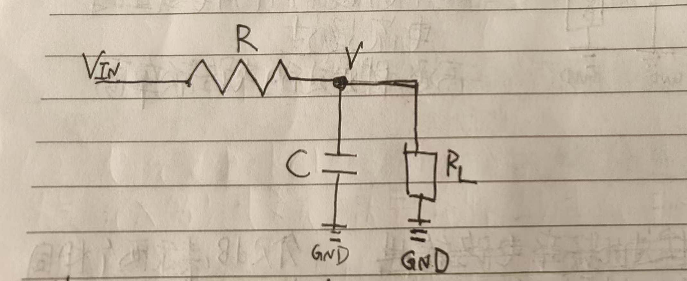

  

其中$R=20KΩ,R_L=20KΩ,C=100μF$

1.计算等效电阻  
从电容两边看过去，两个电阻并联  
$R_{Eq}=\frac{R_L*R}{R_L+R}=10KΩ$  
2.计算时间常数$\tau$  
$\tau=R_{Eq}*C=1s$
3.计算截止频率  
$f_c=\frac{1}{(2\pi\tau)}\approx0.159154Hz$

  

| 项目 | 单位 | 手算 | 仿真 | 相对误差 |
| --- | --- | --- | --- | --- |
| $R_{eq} = \frac{R_L*R}{R_L+R}$ | kΩ | 10.000 | 10.002 | +0.017% |
| τ（63.2% 判据） | s | 1.0000 | 1.0002 | +0.017% |
| $f_c =\frac{1}{(2\pi\tau)}$ | Hz | 0.15915 | 0.15914 | -0.009% |
| 低频增益  | V/V | 0.5000 | 0.5000 | +0.000% |
| 低频增益 | dB | -6.021 | -6.021 | -0.000% |
| $f_c$ 处相位 | ° | -45.00 | -45.00 | -0.006% |
| 方波稳态高电平 | V | 0.4933 | 0.4933 | +0.001% |
