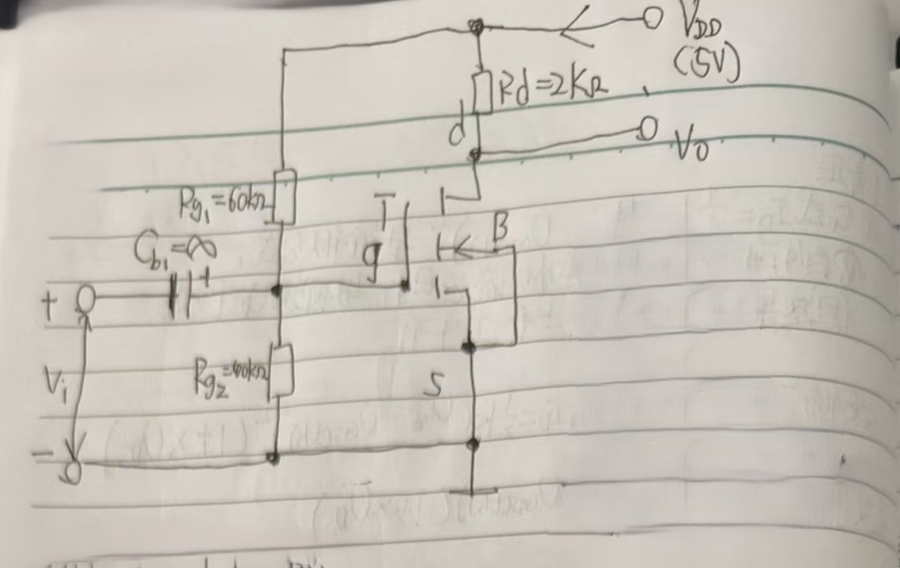
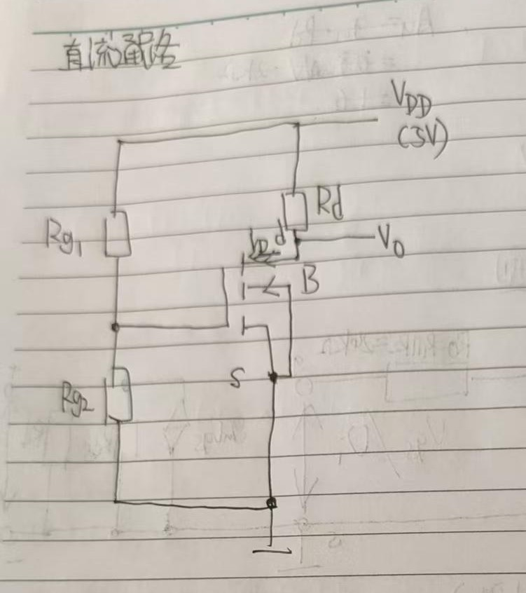
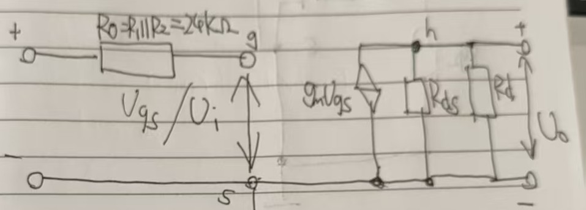

1.求解静态工作点Q

假设此时管子处于饱和区  
对于静态工作点，g-s之间断路，$U_{gs}=U_{R_{g2}}$  
$R_{g1}$和${R_{g2}}$之间串联，共同分压$V_{DD}$  
$U_{R_{g2}}=V_{DD}*\frac{R_{g2}}{R_{g2}+R_{g1}}=2V$  
$U_{gs}=2V$  

$I_D=\frac{K}{2}(U_{gs}-U_{gs(th)})^2=0.4mA$
由于$\lambda=\frac{0.02}{V}$带入后$I_D=0.433mA$  
误差较小，选择忽略  
$V_{DS}+I_{D}*R_{D}=V_{DD}$
$V_{DS}=4.2V>U_{GS}-U_{GS(th)}=1V$  
处于饱和区的假设成立  
2.求解小信号

$g_m=\frac{2I_D}{U_{gs}-U_{gs(th)}}=0.8mA/V$  
$|A_U|=g_m*(R_{DS}||R_{D})$  
$R_{DS}=\frac{1}{\lambda I_{D}}$  
解得$|A_{U}|\approx1.5748$  
  

|项目|手算|仿真|误差|
|-|-|-|-|
|V\_GS (V)|2.0000|2.0000|+0.00%|
|I\_D (mA)|0.4000|0.4331|+8.27%|
|V\_DS (V)|4.2000|4.1339|-1.57%|
|是否饱和|是|是||
|g\_m (mA/V)|0.8000|0.8661|+8.27%|
|R\_ds (kΩ)|125.00|125.00|+0.00%|
|R\_i (kΩ)|24.0|24.0|0.00%|
|R\_o (kΩ)|—|1.97||
|A\_v|-1.5748|-1.7050|+8.27%|
|相位差 (°)|180|-179.96||