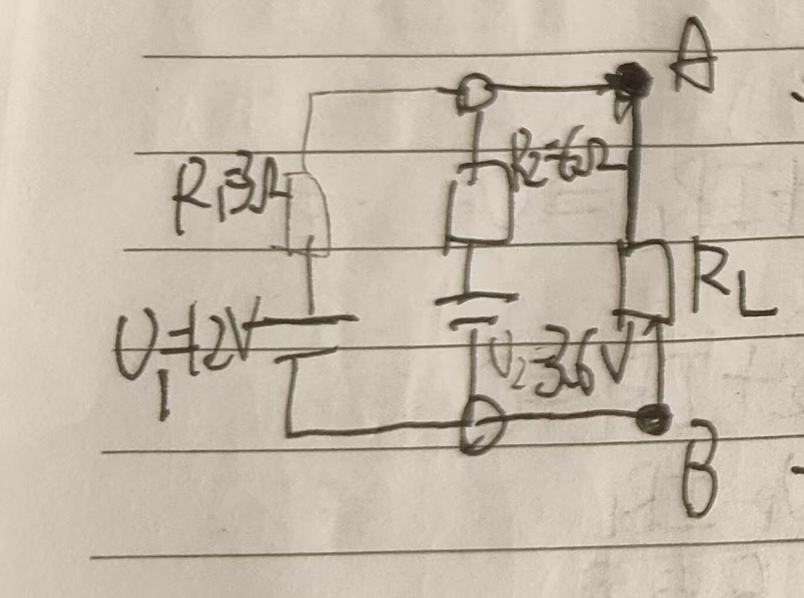

其中$R_1=3Ω,R_2=6Ω,U_1=1.2V,U_2=3.6V$
验证戴维南定理，即验证AB左侧(如图)  
  
可以被等效为一个理想电源$U_oc$和电阻$R_e$串联的组合
1.计算$U_e，R_e$

1.对节点B  
$I_1+I_2=I$  
2.对ACDFA
$-U_1+I_1*R_1+I*R_L=0$
$I_1=\frac{U_1-IR_L}{R_1}$ ① 

3.对BCDEB
$U_2+I_2*R_2+I*R_L=0$  
$I_2=\frac{U_2-I*R_L}{R_2}$②  
将①②带入$I_1+I_2=I$ 
解得：
$I=\frac{\frac{U_1*R_2+U_2*R_1}{R_1+R_2}} {R_L+\frac{R_1*R_2}{R_1+R_2}}$
待定系数
$I=\frac{U_{oc}}{R_L+R_e}$

故$U_{oc}=\frac{U_1*R_2+U_2*R_1}{R_1+R_2}=2V$
  $R_e=\frac{R_1*R_2}{R_1+R_2}=2Ω$
短路电流$I_{sc}=\frac{U_{oc}}{R_e}=1A$

图表如下

[具体的验证表格](./res/thevenin_table.md)